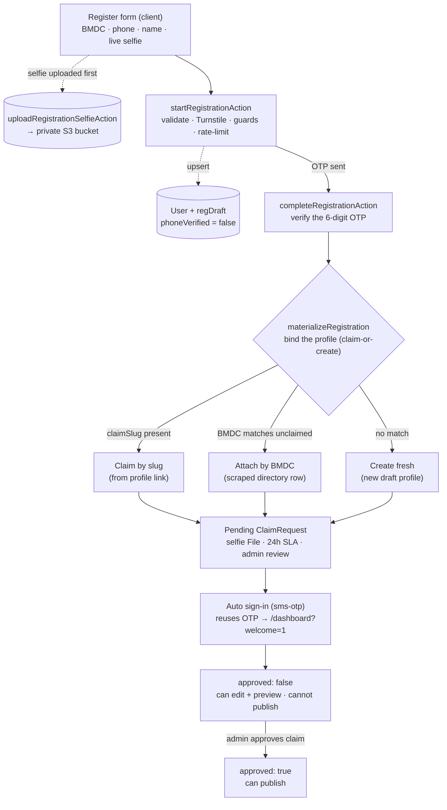

# Doctor registration flow

How a doctor goes from the public register form to a live, owned profile on
**Daktar.Link**. Doctors authenticate with **phone + SMS OTP — no password**
(admins use email + password, see [§ Related flows](#related-flows)).

The trust boundary is our **hashed, TTL'd, rate-limited OTP state**, not the SMS
channel. Every server action below lives in
[`src/server/actions/auth.ts`](../src/server/actions/auth.ts); the NextAuth
providers live in [`src/lib/auth/config.ts`](../src/lib/auth/config.ts).

---

## Flow at a glance

---

## Entry points

| URL | Purpose |
|---|---|
| `/auth/register` | Fresh signup (no existing profile) |
| `/auth/register?slug=<doctor-slug>` | Claim a scraped/unclaimed profile (from the "Claim this profile" CTA on a public `/[slug]` page) |

The page ([`src/app/(auth)/auth/register/page.tsx`](../src/app/(auth)/auth/register/page.tsx))
does **not** bounce logged-in visitors, so a profileless account can return here
to recover (see [§ Edge cases](#edge-cases--robustness)).

---

## Phase 1 — the form + live selfie (client)

[`register-form.tsx`](../src/app/(auth)/auth/register/register-form.tsx) collects:

- **BMDC number**, **phone**, **first/last name** — required
- a **mandatory live-camera selfie** ([`selfie-capture.tsx`](../src/app/(auth)/auth/register/selfie-capture.tsx) — `getUserMedia` → `<canvas>` → JPEG; **no gallery upload**, retake-safe)
- **email** (optional), **referral code** (optional, from `?ref=`)

Before the details are submitted, the selfie is uploaded on its own via
**`uploadRegistrationSelfieAction`** — unauthenticated, IP-rate-limited,
**magic-byte validated** (not the client MIME), server-side optimized, streamed
to the **private** S3 bucket. It returns `{ key, sha256, size, mime }`, which the
form carries into the next step. (See [CLAUDE.md #17](../CLAUDE.md) / #22.)

---

## Phase 2 — `startRegistrationAction` → "send OTP"

Validates and stages the registration, then sends the code. In order:

1. **Zod validate** (`RegisterSchema`) + normalize phone (BD format) + normalize BMDC.
2. **Turnstile** verify (before the per-phone limiter, so junk tokens can't burn a victim number's budget).
3. **Phone guard** — block only if the verified phone already has an **actual provisioned Doctor**. A verified-but-profileless User is allowed through so it can recover.
4. **BMDC guard** — block only if a **claimed** doctor already owns that BMDC. (An *unclaimed* match is allowed — it's handled by auto-attach in Phase 3.)
5. **Slug guard** (claim path) — the target slug must exist and be unclaimed.
6. **Email uniqueness** (when an email is provided).
7. **Per-phone OTP rate-limit.**
8. **Resolve referral code** (best-effort; never blocks signup).
9. **Upsert a phone-keyed `User`** carrying a **`regDraft`** subdoc — `{ firstName, lastName, email, bmdcNumber, claimSlug, selfie key+metadata, referral, expiresAt }` — plus the hashed OTP + TTL.
10. **Send the OTP** over SMS (SSL Wireless). If a real provider is configured but the send fails, the action returns an error instead of advancing; in dev (no provider) it no-ops and logs the code.

At this point a **`User` row exists but `phoneVerified` is still `false` and no
`Doctor` exists yet.** An abandoned registration (OTP never verified) leaves no
half-bound profile — `regDraft.expiresAt` gates materialization. (See [CLAUDE.md #16](../CLAUDE.md).)

---

## Phase 3 — `completeRegistrationAction` → verify OTP

1. Validate phone + 6-digit OTP shape; **per-phone verify rate-limit**.
2. Load the `User` + `regDraft`; check: not deleted, `regDraft` present and not expired, OTP hash present and not expired, attempts `< max`.
3. Compare the OTP hash (wrong code → increment attempts).
4. Call **`materializeRegistration`** (see below), wrapped in try/catch → a failure returns a friendly error **and preserves `regDraft`** so the user can retry.
5. On success: clear `regDraft`, set **`phoneVerified: true`**, **`approved: false`**, EMR seat `pending`, reset OTP attempts, and **leave the OTP hash valid** so the client can auto-sign-in with the same code. Also stamps `OutboundMessage.claimedAt` for claim attribution.

### `materializeRegistration` — claim-or-create

Binds the registration to exactly one `Doctor`, in priority order:

1. **Claim by slug** — if `claimSlug` is set, atomically claim that profile (`findOneAndUpdate({ slug, isClaimed:false })`). Throws if it was claimed in the meantime.
2. **Attach by BMDC** — else, if the BMDC matches an **unclaimed** directory profile (e.g. a scraped DocTime/Popular/Ibn-Sina row), atomically claim *that* profile. This avoids a duplicate **and** the `bmdcNumber` unique-index `E11000`.
3. **Create fresh** — else, generate a unique slug and create a new draft `Doctor`. An `E11000` backstop catches a create-race: it claims the raced doc, or returns a friendly, recoverable error (never a raw 500).

In all cases it then mints the **selfie `File`** doc (private bucket) and creates a
**pending `ClaimRequest`** (24h verification SLA), records the referral (if any),
and swaps a synthetic `@phone.daktar.link` email for the real one when supplied.

---

## Phase 4 — auto sign-in + post-registration state

The client immediately calls `signIn("sms-otp", { phone, otp })` reusing the
still-valid OTP. The **`sms-otp`** provider's `authorize`
([`config.ts`](../src/lib/auth/config.ts)) re-validates the OTP, sets
`phoneVerified: true` + `lastLoginAt`, clears the OTP, and issues a **30-day JWT
session** → the doctor lands on `/dashboard?welcome=1`.

**`User.approved` gates publishing, not login** ([CLAUDE.md #1c](../CLAUDE.md)):

- A new doctor (`approved: false`) **can log in, edit, and preview immediately**.
- They **cannot publish** until an admin approves the `ClaimRequest` in `/admin/verifications` (`approveClaimAction` flips `approved: true` + `bmdcVerified`).
- Even after approval, publishing also requires the 4 mandatory fields (name & title, photo, ≥1 specialty, ≥1 qualification).

---

## Related flows

- **Returning login** — `/auth/login`: phone → `requestLoginOtpAction` (sends an OTP; returns a clear "No account found" for unknown numbers) → enter OTP → `sms-otp` session. No password, **no approval gate**.
- **Admin** — `/auth/email/login`: email + bcrypt password via the original Credentials provider. Admins are bounced to `/admin`; doctors to `/dashboard` (role gate in [`src/proxy.ts`](../src/proxy.ts)).
- **Email verify / password reset** — `verifyEmailAction` / `forgotPasswordAction` / `resetPasswordAction` (admin/email accounts only).

---

## Edge cases & robustness

- **Abandoned registration** (OTP never entered) — harmless: a `User` with an expired `regDraft` and no `Doctor`. The `regDraft.expiresAt` gate prevents materialization.
- **Failed materialization** (e.g. a DB error mid-flow) — the `regDraft` is **preserved** (only cleared on success), and a verified-but-profileless account can **re-register** with the same phone to recover (the phone guard only blocks *provisioned* phones). The dashboard "No profile yet" card links straight to `/auth/register`.
- **BMDC already in our directory** — an *unclaimed* match → auto-attach (Phase 3 #2); a *claimed* match → blocked early in Phase 2 with a friendly message. This is why a scraped profile and a real registration never collide on the unique `bmdcNumber` index.
- **Self-serve recovery for a lost phone** — not implemented; admin support handles (see [CLAUDE.md](../CLAUDE.md) "Known deferrals").

---

## Quick reference

| Concern | Where |
|---|---|
| Server actions | [`src/server/actions/auth.ts`](../src/server/actions/auth.ts) |
| NextAuth providers (`sms-otp`, admin credentials) | [`src/lib/auth/config.ts`](../src/lib/auth/config.ts) |
| Edge-safe auth proxy / role gate | [`src/proxy.ts`](../src/proxy.ts) |
| Register UI + live selfie | [`src/app/(auth)/auth/register/`](../src/app/(auth)/auth/register/) |
| Selfie upload (private S3) | `uploadRegistrationSelfieAction` ([`src/server/actions/photo.ts`](../src/server/actions/photo.ts)) |
| Validation schema | `RegisterSchema` ([`src/lib/validators/`](../src/lib/validators/)) |
| Admin verification queue | `/admin/verifications` ([`src/app/admin/verifications/`](../src/app/admin/verifications/)) |
| Constraints & rationale | [CLAUDE.md](../CLAUDE.md) #1b, #1c, #16, #17, #20, #21 |
